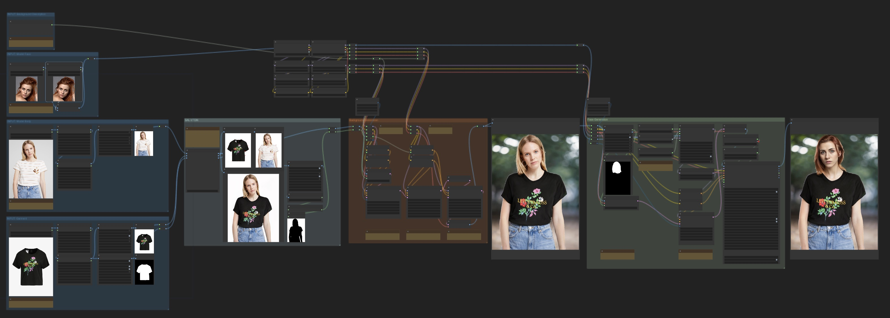
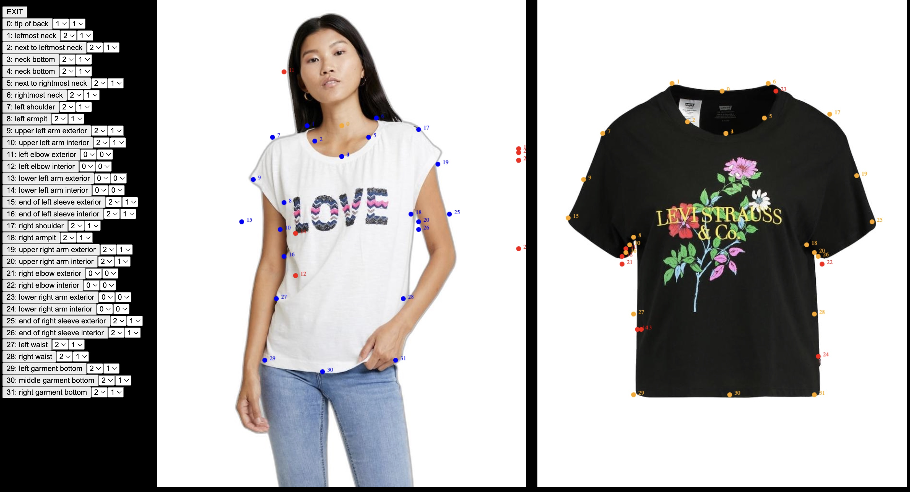

# ComfyUI Workflow for Virtual Try-On Based on SAL-VTON

A ComfyUI Workflow for swapping clothes using [SAL-VTON](https://openaccess.thecvf.com//content/CVPR2023/papers/Yan_Linking_Garment_With_Person_via_Semantically_Associated_Landmarks_for_Virtual_CVPR_2023_paper.pdf).

Generates backgrounds and swaps faces using Stable Diffusion 1.5 checkpoints.

Made with 💚 by the [CozyMantis](https://cozymantis.gumroad.com/) squad.

## Dependencies:
- The [Cozy SAL-VTON node](https://cozymantis.gumroad.com/l/cozy-clothes-swap-comfyui-node-salvton) for swapping clothes
- [Image Resize for ComfyUI](https://github.com/palant/image-resize-comfyui) for cropping/resizing
- [WAS Node Suite](https://github.com/WASasquatch/was-node-suite-comfyui) for removing the background
- [ComfyUI Essentials](https://github.com/cubiq/ComfyUI_essentials) for the mask preview and remove latent mask nodes
- [ComfyUI IPAdapter plus](https://github.com/cubiq/ComfyUI_IPAdapter_plus) for face swapping
- [Impact Pack](https://github.com/ltdrdata/ComfyUI-Impact-Pack) for face detailing
- [Cozy Human Parser](https://github.com/cozymantis/human-parser-comfyui-node) for getting a mask of the head
- [rgthree](https://github.com/rgthree/rgthree-comfy) for seed control
- If you need the background generation and face swap parts of the workflow, we recommend downloading [Realistic Vision v6.0](https://civitai.com/models/4201?modelVersionId=245598) and [its inpainting version](https://civitai.com/models/4201?modelVersionId=245627), and placing them in your `models/checkpoints` directory.

## Inputs you'll need

- A model image (the person you want to put clothes on)
- A garment product image (the clothes you want to put on the model)
- Garment and model images should be close to 3:4 aspect ratio, and at least 768x1024 px.
- (Optional) One or two portraits for face-swapping

> [!IMPORTANT]  
> Make sure you own the rights to the images you use in this workflow. Do not use images that you do not have permission to use.

The SAL-VTON models have been trained on the [VITON-HD](https://github.com/shadow2496/VITON-HD) dataset, so for best results you'll want:

- images that have a white/light gray background
- upper-body clothing items (tops, tshirts, bodysuits, etc.)
- an input person standing up straight, pictured from the knees/thighs up.

To help with the first point, this workflow includes a background removal pre-processing step for the inputs.

## Stage 1: Swap the clothes

This stage uses the Cozy SAL-VTON node to run the virtual try-on model on the input images. The model will swap the clothes from the garment product image onto the model image.

Node that SAL-VTON relies on landmark detection to align the garment and model images. The landmark coordinates will be auto-generated the first time you run the workflow. If needed, you can correct the fit by manually adjusting the landmark coordinates and re-running the workflow. Press the "Update Landmarks" button in the Cozy SAL-VTON node to bring up the landmark editor.

## Stage 2: Generate a background

Based on a text input, a background is generated for the dressed model using the following steps:
- with an inpainting model, inpaint the background at full noise
- with a regular model, do another pass at less noise on the background to add more details
- with a regular model, do a very low noise pass on the entire image, to fix small artifacts without changing the cloth details

## Stage 3: Optional face swap

Here we use IPAdapter and inpainting to swap the face of the model with the face provided in the input portraits. This step is optional and can be skipped if you don't have a virtual-influencer-type scenario.

## More Good Stuff

Made with 💚 by the [CozyMantis](https://cozymantis.gumroad.com) squad. Check out our ComfyUI nodes and workflows!

| | |
| --- | --- |
|  [Cozy Portrait Animator - ComfyUI Nodes & Workflow To Animate A Face From A Single Image](https://cozymantis.gumroad.com/l/cozy-animated-portraits-with-stablediffusion-comfyui-aniportrait?layout=profile) | <a href="https://cozymantis.gumroad.com/l/cozy-clothes-swap-comfyui-node-salvton?layout=profile">  Cozy Clothes Swap - Customizable ComfyUI Node For Fashion Try-on</a> |
|  [Cozy Character Turnaround - Generate And Rotate Characters and Outfits with SD 1.5, SV3D, and IPAdapter - ComfyUI Workflow](https://cozymantis.gumroad.com/l/cozy-character-turnaround-animate-comfyui-workflow?layout=profile) | <a href="https://cozymantis.gumroad.com/l/character-face-consistency-reference-sheet-comfyui-workflow-sd15?layout=profile">  Cozy Character Face Generator - ComfyUI SD 1.5 Workflow For Consistent Reference Sheets</a> |

## Acknowledgements

Based on the excellent paper ["Linking Garment With Person via Semantically Associated Landmarks for Virtual Try-On"](https://openaccess.thecvf.com/content/CVPR2023/papers/Yan_Linking_Garment_With_Person_via_Semantically_Associated_Landmarks_for_Virtual_CVPR_2023_paper.pdf) by Keyu Yan, Tingwei Gao, HUI ZHANG, Chengjun Xie.

## Licenses & Commercial Use

Please check licenses and terms of use for each of the nodes and models required by this workflow.

## Misuse, Malicious Use, and Out-of-Scope Use

The workflow should not be used to intentionally create or disseminate images that create hostile or alienating environments for people. This includes generating images that people would foreseeably find disturbing, distressing, or offensive; or content that propagates historical or current stereotypes.
